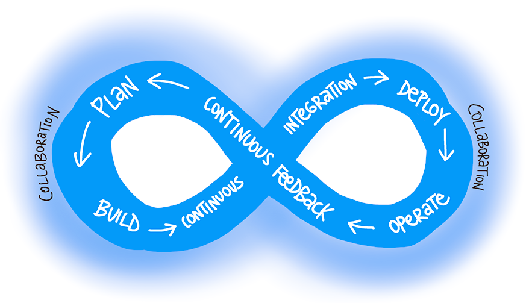

# Aula 10 (01/09/2025) - Funções e Expectativas de um Arquiteto

### Expectativas de um Arquiteto
- Tomar **decisões de arquitetura** alinhadas ao negócio.  
- **Analisar continuamente** a arquitetura para validar sua eficácia.  
- Manter-se **atualizado** com tecnologias, práticas e tendências.  
- Entender profundamente o **domínio do negócio**.  
- Trabalhar junto com **DevOps** e equipes multidisciplinares.  

### DevOps: Propósito
- Entregar **valor contínuo** ao negócio e aos usuários.  
- Baseado em um ciclo de atividades integrado.  

### Ciclo do DevOps (resumido)
1. **Planejar** → definir requisitos, metas e backlog.  
2. **Criar** → desenvolver código de acordo com as necessidades.  
3. **Integrar Continuamente** → unir mudanças de código em um repositório central, com testes automatizados.  
4. **Implantar** → disponibilizar o software em ambientes de produção ou homologação.  
5. **Operar** → monitorar e gerenciar o sistema em execução.  
6. **Validar Continuamente** → coletar feedback, métricas e dados de uso para melhorias.  
7. **Return (loop)** → reavaliar e voltar ao planejamento, fechando o ciclo.  

🔗 Referência: [Microsoft Learn - What is DevOps](https://learn.microsoft.com/en-us/training/modules/introduction-to-devops/2-what-is-devops)
