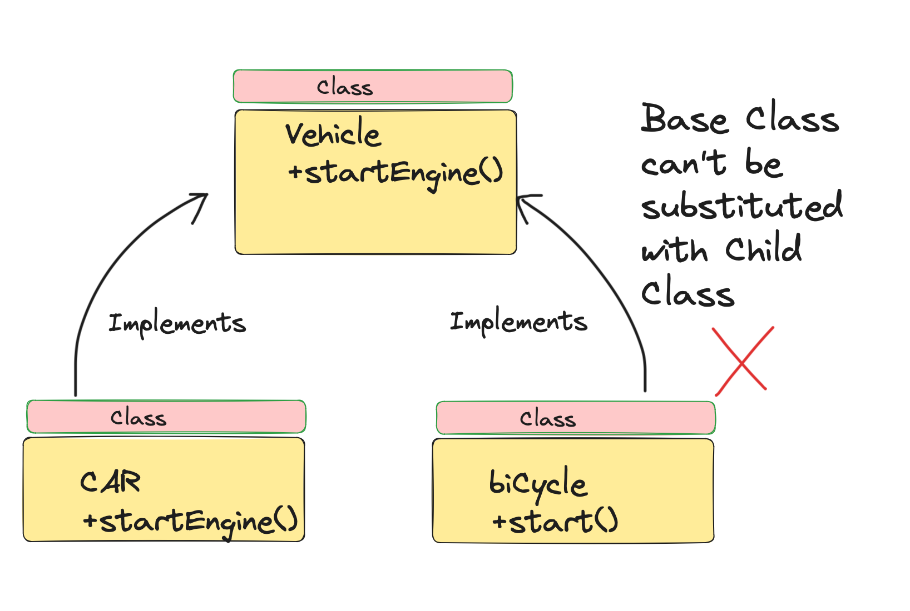
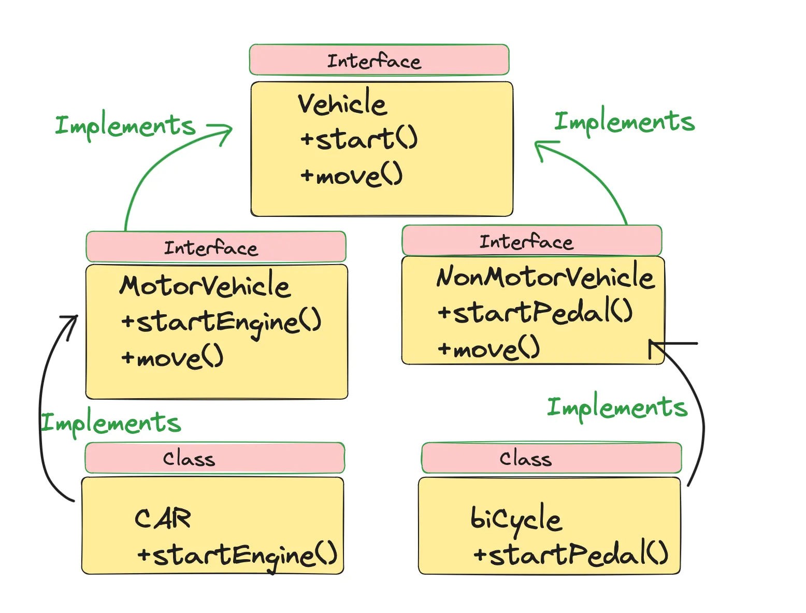

# Aula 6 (14/08/2025) - SOLID

## Liskov Substitution Principle (Princípio de Substituição de Liskov)

"Se S é um subtipo de T, então objetos do tipo T em um programa podem ser substituídos por objetos do tipo S sem alterar nenhuma das propriedades desejáveis do programa (correção, tarefas realizadas, etc.).". Barbára Liskov

Esse princípio fala que objetos podem ser substituídos por seus subtipos sem que isso afete a execução correta do programa.

### No exemplo abaixo, carro e bicicleta ambos são veículos, mas a bicicleta não pode implementar a classe veículo porque a bicicleta não tem um motor.

### Resolução do problema usando LSP. Veículo torna-se uma classe generalizada, que é implementada por Veículo Motorizado e Não Motorizado. Agora, tanto o carro quanto a bicicleta podem substituir a superclasse e as interfaces.

